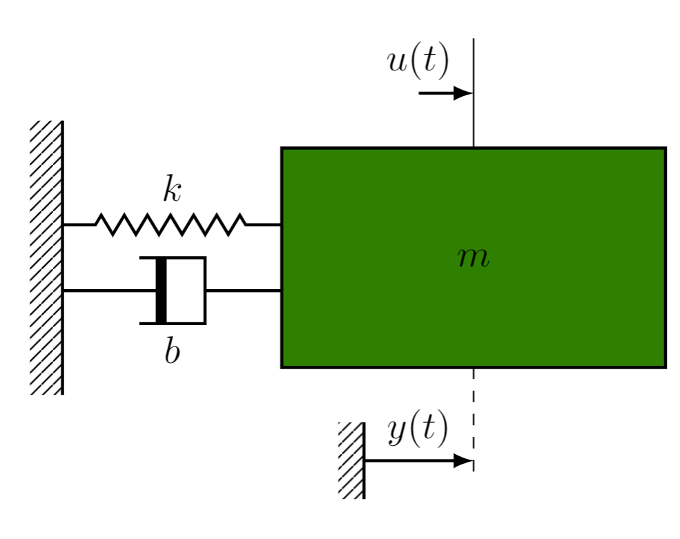

# Programação e IDE 

Algumas anotações aqui sobre nossa abordagem e ferramentas.

Para iniciar temos um bom concenso, vamos de

  

Com python podemos simular nossos sistemas, fazer animações, sites e até mesmo interface gráfica. Basta escolher o pacote certo. Ao final teremos um arquivo *.py* ou um *.ipynb*. É desejável que você conheça a diferença.

  
  Como IDE de programação gosto do VsCode, mas isso é uma questão pessoal mesmo, alguns preferem Anaconda, Pytorch, Bloco de notas, ...
  
  

  A regra aqui é: Instale python, depois instale sua IDE e tente um *hello world* para começar.

---

# Massa mola amortecedor

Faremos a simulação de um sistema conhecido por todos, o massa mola amortecedor:



Você deve saber como chegar na EDO:

$$ m\frac{d^2y(t)}{dt^2} + b\frac{dy(t)}{dt} + ky(t) = u(t)$$

E a partir dela na função de transferência:

$$ G(s) = \frac{1}{ms^2 + bs + c} $$

---

# Massa mola amortecedor

A terceira e última forma de interesse é a representação em espaço de estados.

Basicamente, fazendo $x_1(t) = y(t)$ e $x_2(t) = y'(t)$ pode-se escrever uma 
equação de primeira ordem para cada variável.

$$
\begin{align}
\dot{x}_1 &= f_1(x,u) = x_2\\
\dot{x}_2 &= f_2(x,u) = -\frac{k}{m}x_1 -\frac{b}{m}x_2 + \frac{1}{m}u
\end{align}
$$

Como  o sistema é LIT, pode-se escrever a forma vetorial-matricial.
$$
\begin{bmatrix}
  \dot{x}_1 \\
  \dot{x}_2
\end{bmatrix}
=
\begin{bmatrix}
  0 & 1 \\
  -k/m & -b/m
\end{bmatrix}
\begin{bmatrix}
  {x}_1 \\
  {x}_2
\end{bmatrix}
+
\begin{bmatrix}
  0 \\
  1/m
\end{bmatrix}
u(t)
$$

Ou simplesmente:

$$ \dot{x} = Ax + Bu $$


---
# Simulação do MMA em python

Vamos a simulação do massa mola amortecedor, ela seguirá os seguintes passos:

- Importação de bibliotecas python;

- Parâmetros do sistema e declaração do modelo;

- Simulação (integração) do modelo dinâmico;

- Apresentação gráfica dos resultados.

---

# Importando bibliotecas python:

Penso que todos estejam falimiariados em como carregar as bibliotecas e funções necessárias:
```{python}
import numpy as np
from scipy.integrate import solve_ivp
import matplotlib.pyplot as plt
```

## Parâmetros do sistema:

No caso de simulação de um sistema dinâmico qualquer, 
pode-se iniciar com a declaração dos seus parâmetros.

Para o MMA tem-se então:


```{python}
m = 1.0 # Massa;
b = 0.8 # Coeficiente de amortecimento;
k = 1.2 # Constante elástica da mola;
```

--- 

# O modelo dinâmico

- Vamos usar o modelo por espaço de estados:

```{python}
  def MassaMolaAmortecedor(x,t,u):
    x1, x2 = x 

    dx1 = x2
    dx2 = -(k/m)*x1 - (b/m)*x2 +(1/m)*u
    
    dx = np.array([x1, x2])
    
    return dx
```

---

# Integração do modelo dinâmico:


