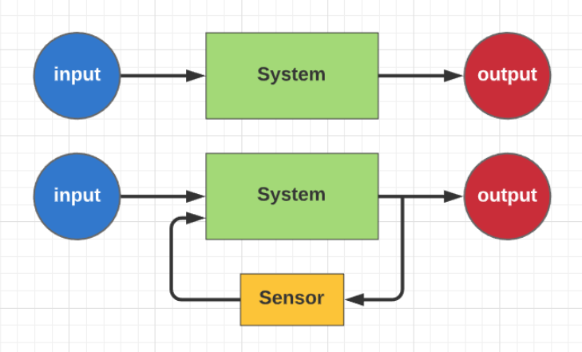
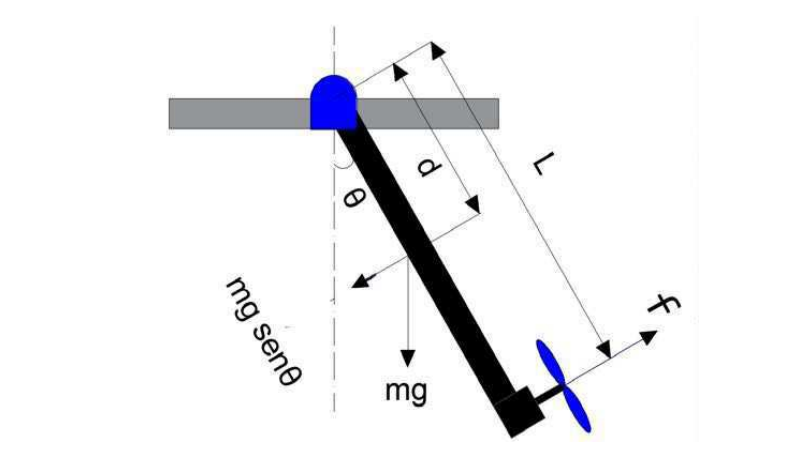
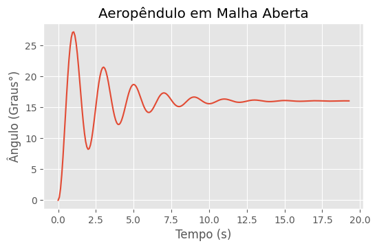

<script src='https://cdnjs.cloudflare.com/ajax/libs/mathjax/2.7.4/MathJax.js?config=default'></script>

# Simulação Gráfica do Aeropêndulo com a Biblioteca **VPython**

Sistemas de controle têm como objetivos modelar, controlar e regular o comportamento de um processo ou sistema físico. Ele é amplamente utilizado em diversas áreas, como engenharia, física, química e biologia, para garantir que o sistema ou processo seja mantido dentro de um determinado conjunto de parâmetros ou condições.

<center>
<div class="figure" >
    
  <p>Figura 1 - Animação do aeropêndulo usando a biblioteca vpython.</p>
</div>
</center>

Nas Engenharias, muito dos sistemas estudados são físicos, quando se modela matematicamente esses sistemas, fica complicado para o aluna assimilar o comportamento do sistema real a partir dos gráficos dos estados, por outro lado, a implementação de protótipos se torna um empecilho para o processo de aprendizagem, já que demanda conhecimento de outra áreas, além do custo na compra de componentes, sendo assim, a simulação gráfica desses sistemas usando liguagens de programação proporciona ao aluno uma excelente forma de visualizar o comportamento do sistema real sem custos de implementação já que as linguagens de programação são gratuitas.

Para a implementação da simulação gráfica do Aeropêndulo, foi usada a linguagem de programação Python com a biblioteca Vpython, a Figura 2 mostra o simulador.

<center>
<div class="figure" >
    
  <p>Figura 2 - Animação do aeropêndulo usando a biblioteca vpython.</p>
</div>
</center>

## O que é o Aeropêndulo?

O aeropêndulo é um dispositivo utilizado em experimentos de física que combina os princípios de um pêndulo e da aerodinâmica. Ele consiste em uma haste suspensa por um ponto fixo em um suporte, com uma asa em uma das extremidades da haste.

Quando o aeropêndulo é movido para um lado, a força da gravidade faz com que a haste comece a oscilar em torno do ponto de suspensão. A asa no final da haste também gera uma força aerodinâmica que pode afetar o movimento do pêndulo. A interação entre as forças gravitacionais e aerodinâmicas faz com que o aeropêndulo execute movimentos complexos e interessantes.

<br>

---

<br>

# Modelagem e Simulação Aeropêndulo

<center>
<div class="figure" >
   
  <p>Figura 3 - Diagrama esquemático do Aeropêndulo.</p>
</div>
</center>

Usando as leis de Newton e momentos angulares podemos encontrar o modelo matemático que descreve a dinâmica do aeropêndulo, assim, temos a equação $$(1)$$ que modela o sistema em questão.

$$\begin{align}
    T &= J\ddot{\theta} + c\dot{\theta} +mgd\sin{\theta} \tag{1}\\
\end{align}
$$


Onde:

<ul>
  <li><b>T</b>: Empuxo gerado pela hélice;</li>
  <li><b>J</b>: Momento de inércia;</li>
  <li><b>θ</b>: posição angular do Aeropêndulo;</li>
  <li><b>c</b>: coeficiente de amortecimento viscoso;</li>
  <li><b>m</b>: peso do Aeropêndulo;</li>
  <li><b>d</b>: a distância entre o centro de massa e o ponto de pivô;</li>
</ul>

## Linearização do Sistema

Uma das técnicas de linearização quando se tem sistemas não lineares que a componente não linear é o seno ou cosseno é  considerar o seno ou cosseno sendo o valor do próprio ângulo, isso funciona bem para pequenas variações em torno do ângulo, aplicando essa técnica ao modelo do aeropêndulo, temos a equação $$(2)$$.

$$
\begin{align}
    T &= J\ddot{\theta} + c\dot{\theta} +mgd\theta \tag{2}\\
\end{align}
$$

Aplicando a transformada de Laplace, temos:

$$
\begin{align}
    T(S) &= S^2J\theta(S) + Sc\theta(S) +mgd\theta(S) \tag{3}\\
    T(S) &= (S^2J + Sc +mgd)\theta(S) \tag{4}\\
    \frac{\theta(S)}{T(S)} &= \frac{1}{S^2J + Sc +mgd} \tag{5}\\
    \frac{\theta(S)}{T(S)} &= \frac{1/J}{S^2 + Sc/J +mgd/J} \tag{6}\\
\end{align}
$$

Queremos controlar o ângulo do braço do aeropêndulo  a partir da tensão aplicada aos terminais do motor, assim,devemos encontrar uma relação entre a tensão $$V$$ nos terminais do motor e o empuxo $$T$$ gerado pela hélice, essa relação é não linear, porém é possível aproximar por uma relação linear, como mostra a expressão $$(7)$$.

$$
\begin{align}
    T &\approx K_mV \tag{7}\\
\end{align}
$$

Aplicando a transformada de Laplace, temos:

$$
\begin{align}
    T(S) &\approx K_mV(S) \tag{8}\\
\end{align}
$$

Agora podemos substituir $$(8)$$ em $$(6)$$,

$$
\begin{align}
    \frac{\theta(S)}{K_mV(S)} = \frac{1/J}{S^2 + Sc/J +mgd/J} \tag{9}\\
    \frac{\theta(S)}{V(S)} = \frac{K_m/J}{s^2 + Sc/J +mgd/J} \tag{10}
\end{align}
$$


## Sistema no Espaço de Estados

### Forma Canônica de Controlador

$$
\begin{align}
    x_1&=\theta \quad x_2=\dot{\theta} \quad x_2 = \dot{x_1}
\end{align}
$$

$$
\begin{bmatrix}
    \dot{x}_1 \\
    \dot{x}_2
\end{bmatrix}=
\begin{bmatrix}
    0             & 1\\
    -\frac{mgd}{J} & -\frac{c}{J}
\end{bmatrix}\cdot 
\begin{bmatrix}
    x_1 \\
    x_2
\end{bmatrix}+
\begin{bmatrix}
    0 \\
    \frac{K_m}{J}
\end{bmatrix}\cdot u
$$

$$
Y= \begin{bmatrix}
    1 & 0
\end{bmatrix} \cdot
\begin{bmatrix}
    0 \\
    \frac{K_m}{J}
\end{bmatrix} + 0
$$

### Parâmetros para Simulação

Para simulação foi usado os parâmetros do artigo$[1]$.

$$
\begin{align}
\begin{array}{|c|c|}                                        \hline
\text { Parâmetros do Aeropêndulo } & \text{Valores}      \\ \hline
K_m     &   0,0296                                        \\ \hline
d       &   0,03m                                         \\ \hline
J       &   0,0106 Kgm^2                                  \\ \hline
m       &   0,36 m                                        \\ \hline
g       &   9,8 m/s^2                                     \\ \hline
c       &   0,0076 Nms/rad                                \\ \hline
\end{array}
\end{align}
$$

---

## Resposta ao degrau usando Python

Para realizar a simulação da resposta ao degrau foi usado Python com o auxílio das bibliotecas numpy, matplotlib e control, sendo que as bibliotecas numpy e matplotlib são usada para criar as matrizes A, B, C e D e plotar a resposta do do sistema, respectivamente, já a biblioteca control é usada para criar o sistema no espaço de estados e obter a função de transferência, além disso, é possível obter a resposta ao degrau usando a função **step** da biblioteca control, que recebe como parâmetro o sistema criado anteriormente, no espaço de estados ou função de transferência.

### Importando as bibliotecas Python usadas

```
import numpy as np
import matplotlib.pyplot as plt
import control as ct

plt.style.use("ggplot")
```

Variáveis com os parâmetros para simulação do modelo.

```
K_m = 0.0296
m = 0.36
d = 0.03
J = 0.0106
g = 9.8
c = 0.0076
```

Matrizes NumPy do sistema no espaço de estados

```
A = np.array([[0, 1],
              [-(m*g*d)/J, -(c/J)]])

B = np.array([[0, K_m/J]]).T

C = np.array([1, 0])

D = 0
```

<br>

### Sistema no Espaço de Estados

<br>

Para criar o sistema no espaço de estados, foi usado a biblioteca Python, **control**, essa biblioteca permite criar um sistema no espaço de estados a partir das matrizes **A**, **B**, **C**, **D**

```
sys = ct.ss(A, B, C, D)
print(sys)
```

### Obtendo a Função de Transferência a partir do Espaço de Estados

Para obter a função de transferência a partir do sistema no espaço de estados, a biblioteca control implementa uma função, ct.ss2tf(sys), que recebe como parâmetro, o sistema no espaço de estados e retorna a função de transferência.

```
Gs = ct.ss2tf(sys)
Gs
```

### Informações do sistema em malha aberta

Antes de realizar a simulação em malha aberta, é interessante observar as características do sistema, para isso, a biblioteca control implementa algumas função.

#### Explicando as diferentes funções da biblioteca control

A função **ct.step_info()** recebe como parâmetro o sistema no espaço de estados ou uma função de transferência e retorna as características do sistema, para esse exemplo, ao aplicar a função ela retorna diversas características, exemplo:


<ul>
  <li><b>Tempo de acomodação</b> ->    'SettlingTime': 10.308519357198815'</li>
  <li><b>Ultrapassagem Percentual</b> -> 'Overshoot': 69.54106137593485,</li>
  <li><b>Tempo de Subida</b> ->  'RiseTime': 0.396481513738416</li>
</ul>

```
ct.step_info(sys)
```

**saída:**

```
{'RiseTime': 0.396481513738416,
 'SettlingTime': 10.308519357198815,
 'SettlingMin': 0.14343794449344063,
 'SettlingMax': 0.47415111647086844,
 'Overshoot': 69.54106137593485,
 'Undershoot': 0,
 'Peak': 0.47415111647086844,
 'PeakTime': 1.0308519357198815,
 'SteadyStateValue': 0.2796674225245654}
```

A função **ct.damp()** recebe como argumento o sistema no espaço de estados ou a função de transferência e retorna os Autovalores, amortecimento e frequência natural para cada polo do sistema.

```
ct.damp(sys);
```

**saída:**

```
_____Eigenvalue______ Damping___ Frequency_
   -0.3585    +3.139j     0.1135       3.16
   -0.3585    -3.139j     0.1135       3.16
```

A função **ct.poles()** recebe como argumento o sistema no espaço de estados ou a função de transferência e retorna os polos do sistema, para esse caso o sistema é de segunda ordem, pois possui dois pólos.

```
ct.poles(sys)
```

**saída:**

```
array([-0.35849057+3.13948884j, -0.35849057-3.13948884j])
```

A função **ct.zeros()** recebe como argumento o sistema no espaço de estados ou a função de transferência e retorna os zeros do sistema. para esse caso o sistema não possui zeros.

```
ct.zeros(sys)
```

**saída:**

```
array([], dtype=float64)
```

#### Resposta ao degrau

```
t, yout = ct.step_response(Gs)

fig, ax = plt.subplots(figsize=(6, 3.5))
ax.set_title("Aeropêndulo em Malha Aberta")
ax.set_ylabel("Ângulo (Graus°)")
ax.set_xlabel("Tempo (s)")
ax.plot(t, np.rad2deg(yout))
plt.show()
```

**Saída:**

<center>
<div class="figure" >
   
</div>
</center>

<br>

---

<br>

# Referências

<dl>
<dt></dt>
<dd>[1.] JOB, Mila Mary; JOSE, P. Subha Hency. Modeling and control of mechatronic aeropendulum. In: <b> 2015 International Conference on Innovations in Information, Embedded and Communication Systems (ICIIECS)</b>. IEEE, 2015. p. 1-5.</dd>
<dd>...</dd>
</dl>
