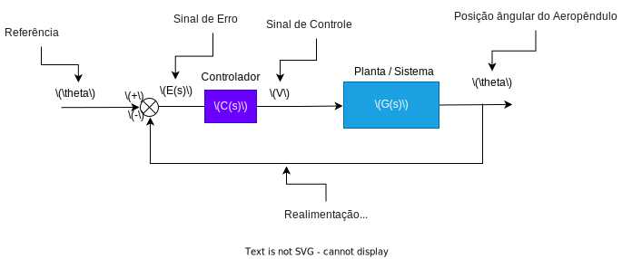
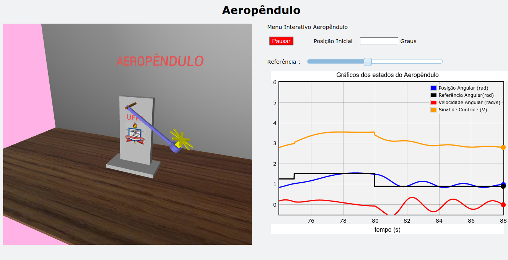
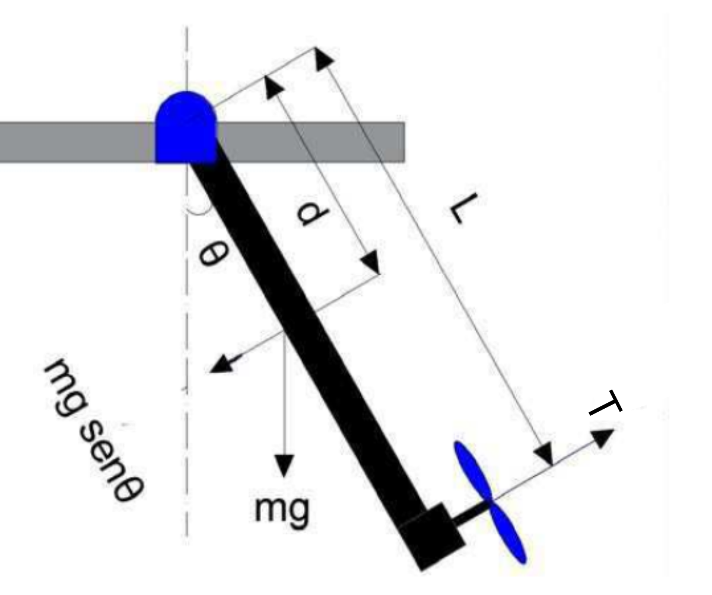
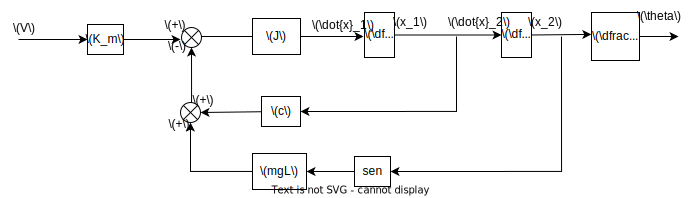
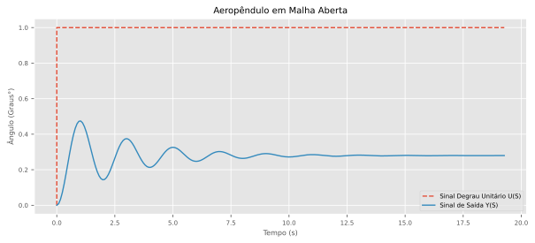
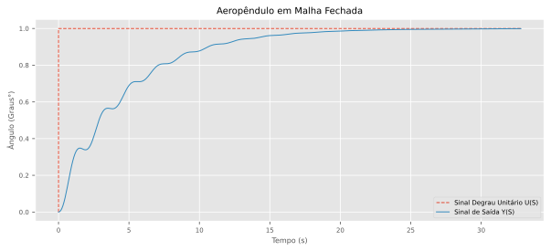

<style>
        .tab {
            display: inline-block;
            margin-left: 40px;
        }
        .tab1 {
            display: inline-block;
            margin-left: 80px;
        }
</style>


<center>
<div class="figure" >
    
</div>
</center>

<center>
<b>Universidade Federal do Pará</b>
</center>
<center>
<b>Campus Universitário de Tucuruí</b>
</center>
<center>
<b>Faculdade de Engenharia Elétrica</b>
</center>

<br>

<span class="tab"></span><b>Projeto:</b> Laboratório Virtual de Sistema de Controle\
<span class="tab"></span><b>Título:</b>: Simulação Gráfica do Aeropêndulo com a Biblioteca <b>VPython</b>\
<span class="tab"></span><b>Autor:</b><a href="https://github.com/Oseiasdfarias" target="_blank">
Oséias Farias</a>\
<span class="tab"></span><b>Orientadores:</b>\
<span class="tab1"></span>Prof. Dr: Raphael Teixeira\
<span class="tab1"></span>Prof. Dr: Rafael Bayma

<br>

<script type="text/javascript" id="MathJax-script" async
  src="https://cdn.jsdelivr.net/npm/mathjax@3/es5/tex-mml-chtml.js">
</script>

## Demostração Simulador

<div style="padding:56.25% 0 0 0;position:relative;"><iframe src="https://player.vimeo.com/video/815726684?h=80089a63c1&autoplay=1&loop=1" style="position:absolute;top:0;left:0;width:100%;height:100%;" frameborder="0" allow="autoplay; fullscreen; picture-in-picture" allowfullscreen></iframe></div><script src="https://player.vimeo.com/api/player.js"></script>

<br>

## Objetivo de Sistemas de Controle

<div align="justify"><p style="text-indent: 50px;">Sistemas de controle têm como objetivos modelar, controlar e regular o comportamento de um processo ou sistema físico. Ele é amplamente utilizado em diversas áreas, como engenharia, física, química e biologia, para garantir que o sistema ou processo seja mantido dentro de um determinado conjunto de parâmetros ou condições.</p></div>

<center>
<div class="figure" >
    
  <p>Figura 1 - Diagrama de blocos do Sistema em Malha Fechada.</p>
</div>
</center>

<div align="justify"><p style="text-indent: 50px;">Nas Engenharias, muito dos sistemas estudados são físicos, quando se modela matematicamente esses sistemas, fica complicado para o aluna assimilar o comportamento do sistema real a partir dos gráficos dos estados, por outro lado, a implementação de protótipos se torna um empecilho para o processo de aprendizagem, já que demanda conhecimento de outra áreas, além do custo na compra de componentes, sendo assim, a simulação gráfica desses sistemas usando liguagens de programação proporciona ao aluno uma excelente forma de visualizar o comportamento do sistema real sem custos de implementação já que as linguagens de programação são gratuitas.</p></div>

<div align="justify"><p style="text-indent: 50px;">Para a implementação da simulação gráfica do Aeropêndulo, foi usada a linguagem de programação Python com a biblioteca Vpython, a Figura 2 mostra o simulador.</p></div>

<center>
<div class="figure" >
    
  <p>Figura 2 - Animação do aeropêndulo usando a biblioteca vpython.</p>
</div>
</center>


## O que é o Aeropêndulo?

<div align="justify"><p style="text-indent: 50px;">O aeropêndulo é um dispositivo utilizado em experimentos de física que combina os princípios de um pêndulo e da aerodinâmica. Ele consiste em uma haste suspensa por um ponto fixo em um suporte, com uma asa em uma das extremidades da haste.</p></div>


<center>
<div class="figure" >
    
  <p>Figura 3 - Aeropêndulo.</p>
</div>
</center>


<div align="justify"><p style="text-indent: 50px;">Quando o aeropêndulo é movido para um lado, a força da gravidade faz com que a haste comece a oscilar em torno do ponto de suspensão. A asa no final da haste também gera uma força aerodinâmica que pode afetar o movimento do pêndulo. A interação entre as forças gravitacionais e aerodinâmicas faz com que o aeropêndulo execute movimentos complexos e interessantes.</p></div>

<br>

---

<br>

# Modelagem e Simulação Aeropêndulo

<center>
<div class="figure" >
   
  <p>Figura 4 - Diagrama esquemático do Aeropêndulo.</p>
</div>
</center>

<div align="justify"><p style="text-indent: 50px;">Usando as leis de Newton e momentos angulares podemos encontrar o modelo matemático que descreve a dinâmica do aeropêndulo, assim, temos a equação $\bf(01)$ que modela o sistema em questão.</p></div>

$$
\begin{align}
  T &= J\ddot{\theta} + c\dot{\theta} +mgd\sin{(\theta)} \tag{01}
\end{align}
$$


<div align="justify"><p style="text-indent: 50px;">Queremos controlar o ângulo do braço do aeropêndulo a partir da tensão aplicada aos terminais do motor, assim,devemos encontrar uma relação entre a tensão $\bf V$ nos terminais do motor e o empuxo $\bf T$ gerado pela hélice, essa relação é não linear, porém é possível aproximar por uma relação linear, como mostra a expressão $\bf(02)$.</p></div>

$$
\begin{align}
    T &\approx K_mV \tag{02} \\
    K_mV &= J\ddot{\theta} + c\dot{\theta} +mgd\sin{(\theta)} \tag{03}
\end{align}
$$

<br>

<center>
<div class="figure" >
   
  <p>Figura 5 - Diagrama de blocos do modelo do Aeropêndulo.</p>
</div>
</center>

<br>

$$
\begin{align}
    \dot{x_2} &= x_1 \tag{04} \\
    \dot{x_1}J &= - x_1c - mgdsen(x_2) + VK_m \tag{05} \\
    \dot{x_1} &= \dfrac{- x_1c - mgdsen(x_2) + VK_m}{J} \tag{06}
\end{align}
$$


Onde:

<div>
<ul>
  <li><b>T</b>: Empuxo gerado pela hélice;</li>
  <li><b>J</b>: Momento de inércia;</li>
  <li><b>θ</b>: posição angular do Aeropêndulo;</li>
  <li><b>c</b>: coeficiente de amortecimento viscoso;</li>
  <li><b>m</b>: peso do Aeropêndulo;</li>
  <li><b>d</b>: a distância entre o centro de massa e o ponto de pivô;</li>
  <li><b>V</b>: Tensão de Entrada do Motor CC Série;</li>
  <li><b>Km</b>: Relação entre o torque e a tensão;</li>
  <li><b>x1 e x2</b>: Estados do Sistema;</li>
</ul>
</div>

<br><br>

## Linearização do Sistema

<div align="justify"><p style="text-indent: 50px;">Uma das técnicas de linearização quando se tem sistemas não lineares que a componente não linear é o seno ou cosseno é  considerar o seno ou cosseno sendo o valor do próprio ângulo, isso funciona bem para pequenas variações em torno do ângulo, aplicando essa técnica ao modelo do aeropêndulo, temos a equação $\bf(07)$.
</p></div>

$$
\begin{align}
    K_mV &= J\ddot{\theta} + c\dot{\theta} +mgd\theta \tag{07}\\
\end{align}
$$

<div align="justify"><p style="text-indent: 50px;">Aplicando a transformada de Laplace, temos:</p></div>

$$
\begin{align}
    K_mV(s) &= s^2J\theta(s) + sc\theta(s) +mgd\theta(s) \tag{08}\\
    K_mV(s) &= (s^2J + sc +mgd)\theta(s) \tag{09}\\
    \frac{\theta(s)}{K_mV(s)} &= \frac{1}{s^2J + sc +mgd} \tag{10}\\
    \frac{\theta(s)}{K_mV(s)} &= \frac{1/J}{s^2 + sc/J +mgd/J} \tag{11}\\
    \frac{\theta(s)}{V(s)} &= \frac{K_m/J}{s^2 + sc/J +mgd/J} \tag{12}
\end{align}
$$

<br>

## Sistema no Espaço de Estados


### Forma Canônica de Controlador

$$
\begin{align}
    x_1&=\theta \quad x_2=\dot{\theta} \quad x_2 = \dot{x_1}
\end{align}
$$

$$
\begin{bmatrix}
    \dot{x}_1 \\
    \dot{x}_2
\end{bmatrix}=
\begin{bmatrix}
    0             & 1\\
    -\frac{mgd}{J} & -\frac{c}{J}
\end{bmatrix}\cdot 
\begin{bmatrix}
    x_1 \\
    x_2
\end{bmatrix}+
\begin{bmatrix}
    0 \\
    \frac{K_m}{J}
\end{bmatrix}\cdot u
$$

$$
Y= \begin{bmatrix}
    1 & 0
\end{bmatrix} \cdot
\begin{bmatrix}
    0 \\
    \frac{K_m}{J}
\end{bmatrix} + 0
$$


### Parâmetros para Simulação


Para simulação foi usado os parâmetros do artigo $\bf[1]$.

$$
\begin{align}
  \begin{array}{|c|c|}                                        \hline
  \text { Parâmetros do Aeropêndulo } & \text{Valores}      \\ \hline
  K_m     &   0,0296                                        \\ \hline
  d       &   0,03m                                         \\ \hline
  J       &   0,0106 Kgm^2                                  \\ \hline
  m       &   0,36 m                                        \\ \hline
  g       &   9,8 m/s^2                                     \\ \hline
  c       &   0,0076 Nms/rad                                \\ \hline
  \end{array}
\end{align}
$$

<br>

## Resposta ao degrau usando Python

<div align="justify"><p style="text-indent: 50px;">Para realizar a simulação da resposta ao degrau foi usado Python com o auxílio das bibliotecas numpy, matplotlib e control, sendo que as bibliotecas numpy e matplotlib são usada para criar as matrizes A, B, C e D e plotar a resposta do do sistema, respectivamente, já a biblioteca control é usada para criar o sistema no espaço de estados e obter a função de transferência, além disso, é possível obter a resposta ao degrau usando a função **step** da biblioteca control, que recebe como parâmetro o sistema criado anteriormente, no espaço de estados ou função de transferência.</p></div>

### Importando as bibliotecas Python usadas


```python
import numpy as np
import matplotlib.pyplot as plt
import control as ct

plt.style.use("ggplot")
```

Variáveis com os parâmetros para simulação do modelo.

```python
K_m = 0.0296
m = 0.36
d = 0.03
J = 0.0106
g = 9.8
c = 0.0076
```

Matrizes NumPy do sistema no espaço de estados

```python
A = np.array([[0, 1],
              [-(m*g*d)/J, -(c/J)]])

B = np.array([[0, K_m/J]]).T

C = np.array([1, 0])

D = 0
```

<br>

### Sistema no Espaço de Estados

<br>

<div align="justify"><p style="text-indent: 50px;">Para criar o sistema no espaço de estados, foi usado a biblioteca Python, **control**, essa biblioteca permite criar um sistema no espaço de estados a partir das matrizes **A**, **B**, **C**, **D**</p></div>

```python
sys = ct.ss(A, B, C, D)
print(sys)
```

### Obtendo a Função de Transferência a partir do Espaço de Estados

<div align="justify"><p style="text-indent: 50px;">Para obter a função de transferência a partir do sistema no espaço de estados, a biblioteca control implementa uma função, ct.ss2tf(sys), que recebe como parâmetro, o sistema no espaço de estados e retorna a função de transferência.</p></div>

```python
Gs = ct.ss2tf(sys)
Gs
```

### Informações do sistema em malha aberta

<div align="justify"><p style="text-indent: 50px;">Antes de realizar a simulação em malha aberta, é interessante observar as características do sistema, para isso, a biblioteca control implementa algumas função.</p></div>

#### Explicando as diferentes funções da biblioteca control

<div align="justify"><p style="text-indent: 50px;">A função **ct.step_info()** recebe como parâmetro o sistema no espaço de estados ou uma função de transferência e retorna as características do sistema, para esse exemplo, ao aplicar a função ela retorna diversas características, exemplo:</p></div>

<ul>
  <li><b>Tempo de acomodação</b> ->    'SettlingTime': 10.308519357198815'</li>
  <li><b>Ultrapassagem Percentual</b> -> 'Overshoot': 69.54106137593485,</li>
  <li><b>Tempo de Subida</b> ->  'RiseTime': 0.396481513738416</li>
</ul>

```python
ct.step_info(sys)
```

**saída:**

```
{'RiseTime': 0.396481513738416,
 'SettlingTime': 10.308519357198815,
 'SettlingMin': 0.14343794449344063,
 'SettlingMax': 0.47415111647086844,
 'Overshoot': 69.54106137593485,
 'Undershoot': 0,
 'Peak': 0.47415111647086844,
 'PeakTime': 1.0308519357198815,
 'SteadyStateValue': 0.2796674225245654}
```

<div align="justify"><p style="text-indent: 50px;">A função **ct.damp()** recebe como argumento o sistema no espaço de estados ou a função de transferência e retorna os Autovalores, amortecimento e frequência natural para cada polo do sistema.</p></div>

```python
ct.damp(sys);
```

**saída:**

```
_____Eigenvalue______ Damping___ Frequency_
   -0.3585    +3.139j     0.1135       3.16
   -0.3585    -3.139j     0.1135       3.16
```

<div align="justify"><p style="text-indent: 50px;">A função **ct.poles()** recebe como argumento o sistema no espaço de estados ou a função de transferência e retorna os polos do sistema, para esse caso o sistema é de segunda ordem, pois possui dois pólos.</p></div>

```python
ct.poles(sys)
```

**saída:**

```
array([-0.35849057+3.13948884j, -0.35849057-3.13948884j])
```

<div align="justify"><p style="text-indent: 50px;">A função **ct.zeros()** recebe como argumento o sistema no espaço de estados ou a função de transferência e retorna os zeros do sistema. para esse caso o sistema não possui zeros.</p></div>

```python
ct.zeros(sys)
```

**saída:**

```
array([], dtype=float64)
```

#### Resposta ao degrau

```python
t, yout = ct.step_response(Gs)

fig, ax = plt.subplots(figsize=(6, 3.5))
ax.set_title("Aeropêndulo em Malha Aberta")
ax.set_ylabel("Ângulo (Graus°)")
ax.set_xlabel("Tempo (s)")
ax.plot(t, np.rad2deg(yout))
plt.show()
```

**Saída:**

<center>
<div class="figure" >
   
</div>
</center>


<br><br>


## Controlador projetado usando LGR com auxílio do Matlab


<div align="justify"><p style="text-indent: 50px;">Para fins de teste foi projetado um controlador simples usando o matlab e encontrada a função de transferência com o auxílio da biblioteca Control, por fim foi obtida a equação de diferenças para implementar o controlador no simulador.</p></div>


<center>
<div class="figure" >
   
  <p>Figura 6 - Diagrama de blocos do Sistema em Malha Fechada.</p>
</div>
</center>


### Função de Transferência do Controlador


$$
\begin{align}
C(s) &= \frac{0,2126s + 0,7893}{s} \tag{13}
\end{align}
$$

**Função de Transferência do Controlador usando a biblioteca Control do Python**

```python
numc = np.array([0.2126, 0.7893])
denc = np.array([1, 0])

Cs = ct.tf(numc, denc)
print(Cs)
```

**saída:**

$$
\dfrac{0.2126 s + 0.7893}{s}
$$

### Simulação do Sistema em Malha Fechada

```python
Fs = ct.series(Gs, Cs)
Hs = ct.feedback(Fs, 1, sign=-1)
Hs
```

**saída:**

$$
\dfrac{0.5937s+2.204}{s^3 +0.717s^2+10.58s+2.204}
$$


### Resposta ao degrau unitário

```python
t, yout = ct.step_response(Hs)

plt.rc('xtick', labelsize=7)
plt.rc('ytick', labelsize=7)

fig, ax = plt.subplots(figsize=(7, 4))
ax.set_title("Aeropêndulo em Malha Fechada", fontsize=10)
ax.set_ylabel("Ângulo (Graus°)", fontsize=8)
ax.set_xlabel("Tempo (s)", fontsize=8)
ax.plot([0, 0, t[-1]], [0, 1, 1], "--", lw=1,
        label="Sinal Degrau Unitário U(S)")
ax.plot(t, yout, lw=1., label="Sinal de Saída Y(S)")
ax.legend(fontsize=7)
plt.show()
```

**saída:**

<center>
<div class="figure" >
   
</div>
</center>


<div align="justify"><p style="text-indent: 50px;">Ao analisar o sistema com o controlador, temos que o sistema não possui erro em regime permanente e seu overshoot é zero, no entanto, para que esses requisitos fossem obtidos ouve um aumento no tempo de acomodação.</p></div>

<br>

## Função de Transferência Discreta C(z)

<div align="justify"><p style="text-indent: 50px;">Para discretizar o sistema foi usado um período de amostragem de 0,01s.</p></div>

```python
from control.matlab import c2d

Cz = c2d(Cs, Ts=0.01, method="tustin")
Cz
```

$$
\dfrac{0.2165 z + 0.2087}{z-1} \quad dt = 0.01
$$

$$
\begin{align}
    C(z) &= \dfrac{0,2165z −0,2087}{z-1} \tag{14}\\
         &= \dfrac{0,2165z −0,2087}{z-1} \cdot \dfrac{z^{-1}}{z^{-1}} \tag{15}\\
         &= \dfrac{0,2165 − 0,2087z^{-1}}{1-z^{-1}} \tag{16}\\
\end{align}
$$

#### Encontrando a equação de diferenças do controlador

$$
\begin{align}
C(z) &= \dfrac{U(z)}{E(z)} \tag{20}
\end{align}
$$

onde:

$$
\begin{align}
  U(z) &= Z\{u[k]\} \tag{17}\\
  E(z) &= Z\{e[k]\} \tag{18}\\
  \dfrac{U(z)}{E(z)} &= \dfrac{0,2165 − 0,2087z^{-1}}{1-z^{-1}} \tag{19}\\
  (1-z^{-1})U(z) &= (0,2165 − 0,2087z^{-1})E(z) \tag{20}\\
  U(z)-z^{-1}U(z) &= 0,2165E(z) − 0,2087z^{-1}E(z) \tag{21}\\
  Z^{-1}\{U(z)-z^{-1}U(z)\} &= Z^{-1}\{0,2165E(z) − 0,2087z^{-1}E(z)\} \tag{22}\\
  u[k] − u[k − 1] &= 0,2165e[k] − 0,2087e[k − 1] \tag{23}\\
  u[k] &= u[k − 1] + 0,2165e[k] − 0,2087e[k − 1] \tag{24}
\end{align}
$$


<div align="justify"><p style="text-indent: 50px;">Agora é possível implementar uma classe python para o controlador a partir da equação de diferenças.</p></div>

$$
\begin{align}
  u[k] &= u[k − 1] + 0,2165e[k] − 0,2087e[k − 1] \tag{25}
\end{align}
$$

<div align="justify"><p style="text-indent: 50px;">com a função de diferenças encontrada, agora é possível implementa-la usando python e fecha a malha com o controlador para simular, essa lógica está implementada no simulador.</p></div>

<br><br>

# Referências

<div align="justify"><p style="text-indent: 50px;">
<dl>
<dd><b>[1.]</b> JOB, Mila Mary; JOSE, P. Subha Hency. <b> Modeling and control of mechatronic aeropendulum.</b> In: 2015 International Conference on Innovations in Information, Embedded and Communication Systems (ICIIECS). IEEE, 2015. p. 1-5.</dd>

<br>

<dd><b>[2.]</b> Silva. Yago. <b> Projeto, construção e controle de um aeropêndulo
</b>. Centro de Engenharia Elétrica e Informática, Departamento de Engenharia Elétrica e Informática, Universidade Federal de Campina Grande - UFCG, 2018.</dd>

<br>

<dd><b>[3.]</b> MOHAMMADBAGHERI, Amin; YAGHOOBI, Mahdi. <b>A new approach to control a driven pendulum with PID method.</b> In: 2011 UkSim 13th International Conference on Computer Modelling and Simulation. IEEE, 2011. p. 207-211.</dd>

<br>

<dd><b>[4.]</b> SILVA, Yago Luiz Monteiro et al. <b>Projeto, construção e controle de um aeropêndulo<b>. 2018.</dd>

</dl>
</p></div>