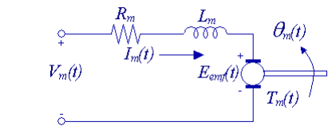

# **Modelagem e simulação de um Motor DC com Python**

Este projeto tem por objetivo servir como auxílio para a compreensão da dinâmica de um motor de corrente contínua. Através de controles interativos será possível observar o comportamento do sistema, no qual os dados serão fornecidos pelo usúario, o que torna a experiência mais livre e didática.

# Controle de posição de um Motor DC

## **Introdução**

Um motor é uma máquina que converte energia elétrica em energia mecânica de rotação.O funcionamento dos motores CC baseia-se no princípio do eletromagnetismo clássico pelo qual um condutor carregando uma corrente e mergulhado em um fluxo magnético fica submetido a uma força eletromagnética.

Realizaremos uma simulação de um sistema contendo um motor DC:

 

   

   Figura 1: Circuito do Motor DC 

## **Modelagem Dinâmica do Motor**
Através da Lei de Kirchhoff, temos a seguinte equação do circuito da figura 1:

$$
\begin{align}
  V_m -R_m I_m - L_m \frac{dI_m}{dt}-E_{emf}=0
\end{align}
$$

Considerando $L_m \leqslant R_m$, a corrente pode ser escrita como:

$$
\begin{align}
  I_m = \frac{V_m - E_{emf}}{R_m}
\end{align}
$$

A tensão contra eletromotriz pode ser descrita por:

$$
\begin{align}
  E_{emf}=K_m \ddot{\theta_m}
\end{align}
$$

No eixo do motor é conectado um redutor de velocidade, com relação de redução $K_g$ e eficiência $\eta_g$. Assim, aplicando a segunda lei de Newton no eixo do motor, temos:

$$
\begin{align}
  J_m\ddot{\theta }=T_m-\frac{T_l}{\eta_g K_g}
\end{align}
$$

o torque devido a carga que está conectada ao redutor é dado por $\frac{T_l}{\eta_g K_g }$

Aplicando a segunda lei de Newton na carga conectada ao redutor, temos:

$$
\begin{align}
  J_l\ddot{\theta_l }=T_l-B_{eq}\dot{\theta_l}
\end{align}
$$

Sendo $B_{eq}$ o fator de amortecimento viscoso.

Substituindo a equação (4) em (5) e organizando:

$$
\begin{align}
  J_l\ddot{\theta_l}= \eta _g K_g T_m - \eta_g K_g J_m \ddot{\theta _m} - B_{eq} \dot{\theta _l}
\end{align}
$$

Sabendo que, considerando a redução, $\theta_m = K_g \theta_l$, e que o torque no motor elétrico vale:

$$
T_m = \eta_m K_t I_m
$$

 (sendo $\eta_m$ a eficiência do motor), pode-se reescrever a equação
(4) como:

$$
\begin{align}
  J_l\ddot{\theta_l}+\eta _g K^2_g J_m\ddot{\theta_l} +B_{eq}\dot{\theta_l} = \eta_g \eta_m K_g K_t I_m
\end{align}
$$

Finalmente combinando as equações elétrica (2) e mecânica (7):

$$
\begin{align}
  \left ( J_l+\eta_g K^2_g J_m \right )R_m\ddot{\theta } + \left ( B_{eq}R_m+\eta_g \eta_m K_m K_t K^2_g  \right )R_m\dot{\theta } = \eta_g \eta_m K_g K_t V_m
\end{align}
$$

 Aplicando a transformada de Laplace, chegamos à seguinte função transferência:

$$
\begin{align}
  \frac{\theta_l(s)}{V_m(s)}=\frac{\eta_g \eta_m K_g K_t}{J_{eq} R_m s^2 + \left ( B_{eq}R_m + \eta_g \eta_m K_m K_t K^2_g J_m \right )s}
\end{align}
$$

Sendo $J_{eq}=J_l + \eta_g K^2_g J_m$ o momento de inércia equivalente do motor.

Assumindo os seguintes valores para as constantes acima:

Eficiência da redução
$\eta_g = 0.9$

Eficiência do motor 
$\eta_m = 0.69$

Fator de redução 
$K_g = 70$

Constante de torque do motor
 $K_t = 0,00767$

Constante de força contra 
eletromotriz 
$K_m=0,00767$

Momento de inércia do motor 
$J_{m} = 3.87\cdot 10^{-7}$

Momento de inércia equivalente do sistema
$J_{eq} = 2\cdot 10^{-3}$

Resistência de armadura 
$R_m=2.6$

Fator de amortecimento viscose 
$B_{eq} = 4\cdot 10^{-3}$

A função transferência do motor é dada por:

$$
\begin{align}
  \frac{\theta_l(s)}{V_m(s)}=\frac{0.3334}{0.00512 s^2 + 0.1894s}=\frac{65.1171}{s^2+36.9921s}
\end{align}
$$

## **Modelagem em Espaço de Estados**

$$
\theta_l(s)(s^2+36.9921s)=65.1171 V(s)
$$

$$
\ddot{\theta_l}+36.9921 \dot{\theta_l} + 0 \theta= 65.1171v
$$

$$
x_1 = \theta_l \\
x_2 = \dot{\theta_l}
$$

$$
\dot{x_1} = \dot{\theta_l}= x_2 \\
\dot{x_2}= 65.1171v-36.9921x_2 - 0x_1
$$

$$
\begin{bmatrix}
\dot{x_1}\\\dot{x_2} 
\\
\end{bmatrix} =\begin{bmatrix}
0 & 1 \\ 
0 &-36.9921 
\end{bmatrix}x +\begin{bmatrix}
0\\ 
65.1171
\end{bmatrix}
$$

